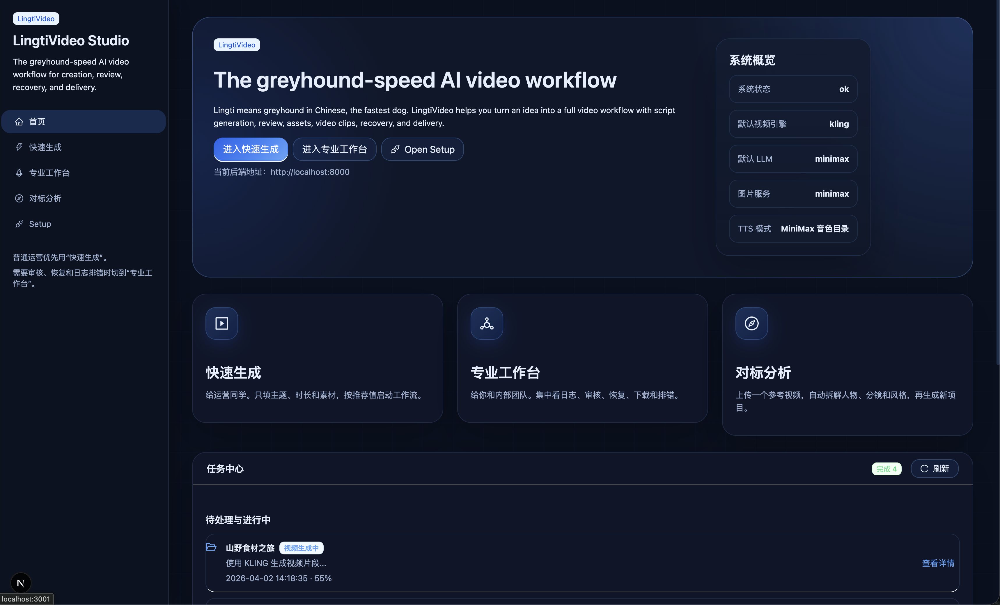
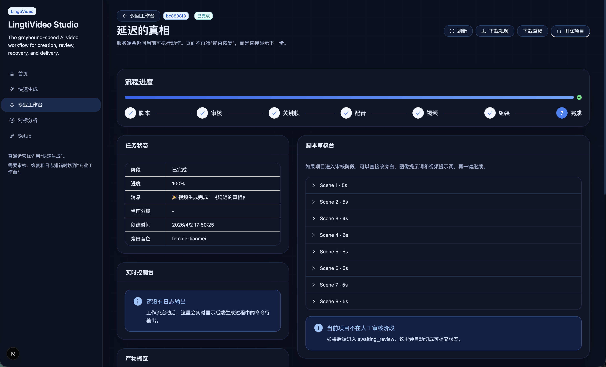

# LingtiVideo

Lingti 在中文里是“灵缇”，也就是速度极快的灰狗。  
**LingtiVideo** 的目标很直接：帮助你更快地把一个想法变成完整视频。

[English README](./README.md)

---

## 截图

### 首页



### 视频生成工作台



---

## 项目简介

LingtiVideo 是一个适合本地运行的开源 AI 视频工作流。

它把下面这些环节串成一条完整生产线：

- 文案 / 选题生成脚本
- 人工审核分镜
- 关键帧图片生成
- TTS 配音
- 图生视频
- FFmpeg 拼接成片
- 字幕导出
- 剪映 / CapCut 草稿生成

它更适合“可恢复、可审核、可排错”的创作流程，而不是一次性黑盒生成。

---

## 当前技术栈

- 后端：FastAPI
- 前端：Next.js + Ant Design
- LLM：DeepSeek / MiniMax / Gemini / OpenAI / Kimi / Zhipu / Ollama
- 图片：MiniMax Image / Gemini 生图
- 视频：Kling / Seedance
- 配音：MiniMax
- 拼接：FFmpeg

---

## 首次使用

当网页检测到缺少必要配置时，会自动弹出配置窗口。

你可以直接在网页里选择并配置：

- 默认 LLM provider 与 model
- 图片 provider 与 model
- 视频 provider 与 model
- TTS model
- 对应服务的 API Key

网页保存后的配置默认写入：

```bash
configs/config.yaml
```

如果你更喜欢手动配置，也可以先复制示例文件：

```bash
cp configs/config.example.yaml configs/config.yaml
```

---

## 快速开始

### 1. 依赖要求

- Python 3.10+
- Node.js 18+
- 已安装 FFmpeg，并且可在 PATH 中访问

验证 FFmpeg：

```bash
ffmpeg -version
```

### 2. 安装

```bash
git clone https://github.com/ruilisi/LingtiVideo.git
cd LingtiVideo

python3 -m venv .venv
source .venv/bin/activate
pip install -r requirements.txt

cd frontend
yarn install
cd ..
```

### 3. 启动后端

```bash
.venv/bin/python -m uvicorn api.server:app --host 0.0.0.0 --port 8000
```

### 4. 启动前端

```bash
cd frontend
yarn dev --port 3001
```

打开：

```text
http://127.0.0.1:3001
```

如果配置不完整，系统会自动弹出引导配置窗口。

---

## CLI 用法

直接用命令行发起视频任务：

```bash
.venv/bin/python cli/main.py run --topic "上海附近现代养老酒店，40 秒，横版介绍视频"
```

测试各模块连接情况：

```bash
.venv/bin/python cli/main.py test --module llm
.venv/bin/python cli/main.py test --module image
.venv/bin/python cli/main.py test --module tts
.venv/bin/python cli/main.py test --module video
```

---

## Web 界面

主要页面：

- `/` 首页
- `/create` 快速生成
- `/studio` 专业工作台
- `/analyze` 对标视频分析
- `/settings` 配置与连接器

主要能力：

- 首次使用自动弹出配置
- 更友好的 provider / model 配置界面
- 分镜审核后再继续生成
- 支持中断恢复
- 实时控制台日志
- 成片、字幕、剪映草稿下载

---

## 关于音色选择

当前内置音色目录和试听能力只对 **MiniMax TTS** 生效。

如果当前 TTS provider 不是 MiniMax，前端不会再展示 MiniMax 音色选择框，而是切换为：

- 手动填写 `voice_id`

这样即使你使用自定义或外部维护的 voice_id 方案，界面也不会误导你去选一个不适用的 MiniMax 音色。

---

## 目录结构

```text
api/                FastAPI 后端
cli/                命令行入口
core/               配置加载和共享设置
modules/            LLM / 图片 / TTS / 视频 / 组装模块
frontend/           Next.js 前端
configs/            示例配置和本地配置
data/               输出、上传、缓存等运行数据
```

---

## 说明

- 这个项目当前更偏向本地创作工作流，而不是多租户 SaaS。
- 某些 provider 已经能在界面层配置，但后端仍然以当前已接好的能力为主。
- FFmpeg 功能依赖你的本地构建。如果本机不支持字幕烧录，LingtiVideo 仍然可以输出 MP4 + SRT。

---

## License

MIT
